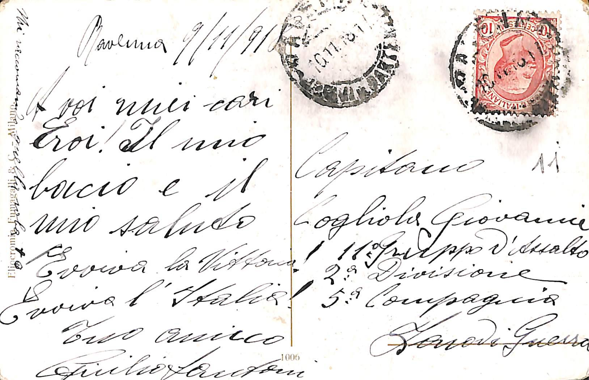
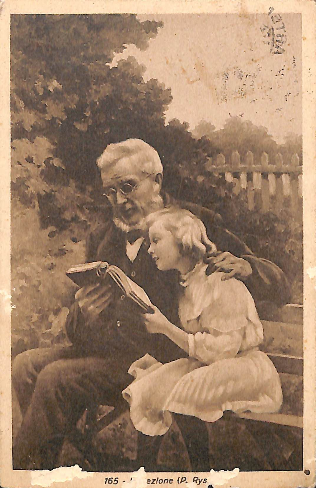
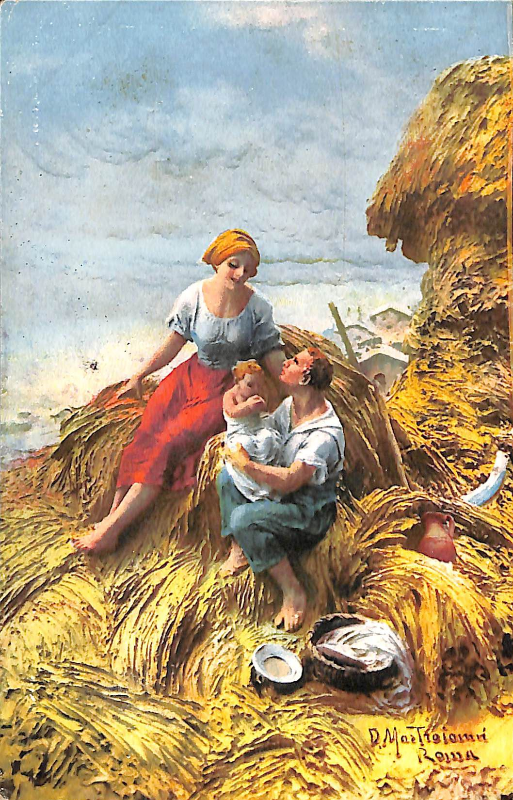
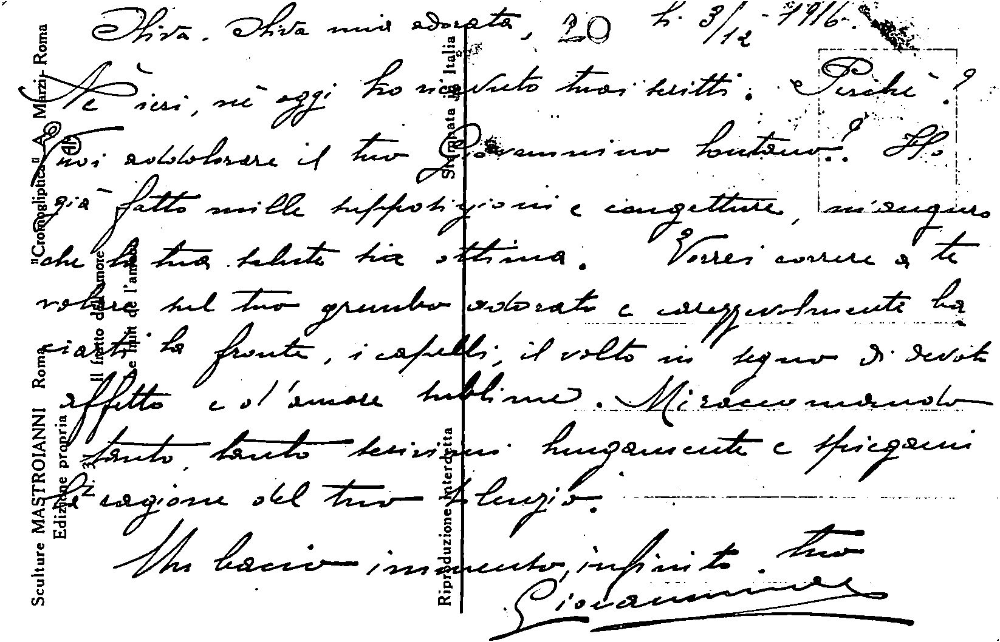

# Progetto Esame - Cartoline
| Fronte | Retro |
| --- | --- |
|  |  |
|  |  |
|  |  |

### Moduli TEI utilizzati nel progetto
| Modulo | Elementi Importati |
| --- | --- |
| core | * |
| header | * |
| textstructure | * |
| msdescription | * |
| namesdates | * |
| transcr | * |
| analysis | s |
| linking | ab |
| figures | figDesc, figure |

### Motivazioni
#### Transcr
> Necessario per suddividere l'immagine della cartolina in varie superfici, immagini _(graphic)_ e zone
#### Figures
> Necessario per descrivere in linguaggio naturale le figure stampate sul fronte delle cartoline
#### Analysis
> ???
#### Linking
> ???

### Validazione con XINCLUDE (MacOS/Linux)
`xmllint main.xml --xinclude --postvalid --noout`
### Validazione con JING (Windows)
`cls; java -jar jing.jar -t teiCustom.rng ./ext/lists.xml ./cartolina_011/main.xml ./cartolina_016/main.xml ./cartolina_020/main.xml`
### Validazione Jing (MacOS/Linux)
`java -jar jing.jar -t teiCustom.rng ./ext/lists.xml ./cartolina_011/main.xml ./cartolina_016/main.xml ./cartolina_020/main.xml`
### Trasformata XSLT (Windows/MacOS/Linux)
`cd .\site`
`xsltproc --xinclude make.xslt ..\corpus.xml > index.html`

###elementi da selezionare in xsl della teiHeader

| Definizione | Ente di appartenenza | Collocazione specifica | Codice identificativo | Titolo | Produzione | Cronologia | Data | Dimensione | Tipologia | Descrizione | Soggetto | Nomi | Luogo | Materiali | Conservazione | Trascrizione | Note | Compilazione | nome compilatore | referente scientifico | Funzionario responsabile | Trascrittore |
| --- | --- | --- | --- | --- | --- | --- | --- | --- | --- | --- | --- | --- | --- | --- | --- | --- | --- | --- | --- | --- | --- | --- | --- | --- | --- |
| Cartolina | Comune della Spezia | Museo Civico Etnografico "Giovanni Podenzana" Sezione dei Cimeli Garibaldini e della 1a guerra mondiale | 7694_011_001/002 | [Soldati al fronte] | - | 1916 | 1918/11/09 | 14x9cm | Artistica | Cartolina Artistica | Soldati, Bandiera Italiana | Giovanni Cogliola | - | Carta | Buono | - | Presenta un timbro sul retro "VERIFICATO PER CENSURA" | 2018 | Tommaso Castagneto | Paolicchi G., Salvatori E. | E. Ratti | - |
| Cartolina | Comune della Spezia | Museo Civico Etnografico "Giovanni Podenzana" Sezione dei Cimeli Garibaldini e della 1a guerra mondiale | 7694_016_001/002 | La Lezione | - | - | - | 14x9cm | Artistica | Cartolina Artistica | Anziano e Bambina | Mario Gineva Nino, Turtura Oliva, Turtura Antonietta | - | Carta | Buono | - | - | 2018 | Tommaso Castagneto | Paolicchi G., Salvatori E. | E. Ratti | - |
| Cartolina | Comune della Spezia | Museo Civico Etnografico "Giovanni Podenzana" Sezione dei Cimeli Garibaldini e della 1a guerra mondiale | 7694_020_001/002 | Il Frutto dell'Amore | Cromogliptica A. Marzi - Roma | 1916 | 1916/12/03 | 14x9cm | Artistica | Cartolina Artistica | Uomo donna e bambino sul fieno | Giovanni, Turtura Oliva, Mastroianni, Marzi A. | Roma | Carta | Buono | - | Sculture di Mastroianni Ediz. Propria N°31 | 2018 | Tommaso Castagneto | Paolicchi G., Salvatori E. | E. Ratti | - |