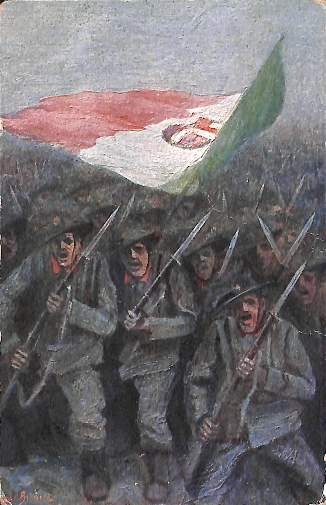

```html
        <div class="postcardWrapper">
            <div style="position: relative;">
                
                <svg height="1081" width="1651" style="transform:scale(0.33); transform-origin:top left; border: 1px solid tomato; position: absolute; top: 0; left: 0; display: inline-block;">
                    <polygon points="190,165 261,32 301,41 298,83 499,88 573,28 742,10 851,51 755,169 637,161 598,229 477,191 429,155 273,161 247,205"
                        style="fill:transparent;stroke:purple;stroke-width:2" />
                </svg>
            </div>

            <div class="fronteWrapper">
                </img>
            </div>
        </div>
```
